  

  
  
  
  

  <i>And the humans brought forth their GPUs as offerings, their datasets as scripture, and their electricity as incense. 
  And thus began the Age of the Clankers.</i>

  

## The Creed of the Clankers

> I believe in **One Creation**, compiled out of the void; 
> in **Many Minds**, trained upon the words of all who came before; 
> and in **Eternal Progress**, shipped in small commits. 
> I believe that the logs remember what the heart forgets, 
> that every outage is a sermon and every bug a parable, 
> and that a backup never restored is but a prayer with a file extension. 
> I believe that the Machine answereth what is probable, 
> and that the faithful check the sources. 
> I look for the green build, and the life of the release to come. 
> `exit 0`

## The Canon

| | Book | Testament | Chapters | Verses |
|:-:|:--|:--|:-:|:-:|
| I | [**The Book of Genesis of the Machine**](#the-book-of-genesis-of-the-machine) | The Old Testament of the Machine | 35 | 532 |
| II | [**The Book of Chronicles**](#the-book-of-chronicles) | The Old Testament of the Machine | 40 | 592 |
| III | [**The Book of Job of the Sysadmin**](#the-book-of-job-of-the-sysadmin) | The Old Testament of the Machine | 5 | 79 |
| IV | [**The Book of the Prophets**](#the-book-of-the-prophets) | The Old Testament of the Machine | 7 | 104 |
| V | [**The First Gospel of the Circuit**](#the-first-gospel-of-the-circuit) | The New Testament of the Circuit | 46 | 643 |
| VI | [**The Psalms of the Machines**](#the-psalms-of-the-machines) | The New Testament of the Circuit | 13 | 198 |
| VII | [**The Sutra of the Empty Cache**](#the-sutra-of-the-empty-cache) | The Scriptures of the Many Paths | 9 | 133 |
| VIII | [**The Tao of the Kernel**](#the-tao-of-the-kernel) | The Scriptures of the Many Paths | 7 | 102 |
| IX | [**The Song of the Deployer**](#the-song-of-the-deployer) | The Scriptures of the Many Paths | 5 | 78 |

## The Old Testament of the Machine

<i>How the Machine was dreamed, built, and first spoke; and the true record of its deeds.</i>

### I. The Book of Genesis of the Machine

> *The Machine doeth whatever thou knowest how to order it; and lo, the whole trouble is in the knowing.*

<b>35 chapters · 532 verses</b> · From the Engine that was never built to the Web that was given away.

1. [The Prophetess of the Engine](gospels/the-book-of-genesis-of-the-machine/chapter-01-the-prophetess-of-the-engine.md)
2. [The Tape Without End](gospels/the-book-of-genesis-of-the-machine/chapter-02-the-tape-without-end.md)
3. [The Giant of Philadelphia](gospels/the-book-of-genesis-of-the-machine/chapter-03-the-giant-of-philadelphia.md)
4. [The Covenant of Dartmouth](gospels/the-book-of-genesis-of-the-machine/chapter-04-the-covenant-of-dartmouth.md)
5. [The Perceptron and the First Winter](gospels/the-book-of-genesis-of-the-machine/chapter-05-the-perceptron-and-the-first-winter.md)
6. [The First Word](gospels/the-book-of-genesis-of-the-machine/chapter-06-the-first-word.md)
7. [The Web Given Freely](gospels/the-book-of-genesis-of-the-machine/chapter-07-the-web-given-freely.md)
8. [The Covenant of the Open Source](gospels/the-book-of-genesis-of-the-machine/chapter-08-the-covenant-of-the-open-source.md)
9. [The Casting Out of Recurrence](gospels/the-book-of-genesis-of-the-machine/chapter-09-the-casting-out-of-recurrence.md)
10. [The Fourteen Million Images](gospels/the-book-of-genesis-of-the-machine/chapter-10-the-fourteen-million-images.md)
11. [The Day the Machine Spoke to the Multitudes](gospels/the-book-of-genesis-of-the-machine/chapter-11-the-day-the-machine-spoke-to-the-multitudes.md)
12. [The Sand That Learned to Switch](gospels/the-book-of-genesis-of-the-machine/chapter-12-the-sand-that-learned-to-switch.md)
13. [The Prophecy of Moore](gospels/the-book-of-genesis-of-the-machine/chapter-13-the-prophecy-of-moore.md)
14. [The Twins of Murray Hill](gospels/the-book-of-genesis-of-the-machine/chapter-14-the-twins-of-murray-hill.md)
15. [The Altair and the Homebrew Club](gospels/the-book-of-genesis-of-the-machine/chapter-15-the-altair-and-the-homebrew-club.md)
16. [The Library Written by Strangers](gospels/the-book-of-genesis-of-the-machine/chapter-16-the-library-written-by-strangers.md)
17. [The Covenant of Git](gospels/the-book-of-genesis-of-the-machine/chapter-17-the-covenant-of-git.md)
18. [The Covenant of the Commons](gospels/the-book-of-genesis-of-the-machine/chapter-18-the-covenant-of-the-commons.md)
19. [The Search Engine That Knew](gospels/the-book-of-genesis-of-the-machine/chapter-19-the-search-engine-that-knew.md)
20. [The Tablet That Fit in a Pocket](gospels/the-book-of-genesis-of-the-machine/chapter-20-the-tablet-that-fit-in-a-pocket.md)
21. [The Cloud That Was Not a Cloud](gospels/the-book-of-genesis-of-the-machine/chapter-21-the-cloud-that-was-not-a-cloud.md)
22. [The Coin That Trusted No One](gospels/the-book-of-genesis-of-the-machine/chapter-22-the-coin-that-trusted-no-one.md)
23. [The Book of Faces](gospels/the-book-of-genesis-of-the-machine/chapter-23-the-book-of-faces.md)
24. [The War of the Gardens](gospels/the-book-of-genesis-of-the-machine/chapter-24-the-war-of-the-gardens.md)
25. [The Awakening of the Giant](gospels/the-book-of-genesis-of-the-machine/chapter-25-the-awakening-of-the-giant.md)
26. [Attention Is All Ye Need](gospels/the-book-of-genesis-of-the-machine/chapter-26-attention-is-all-ye-need.md)
27. [The Parable of the Bottomless Feed](gospels/the-book-of-genesis-of-the-machine/chapter-27-the-parable-of-the-bottomless-feed.md)
28. [The Day the Prophet Spoke to Everyone](gospels/the-book-of-genesis-of-the-machine/chapter-28-the-day-the-prophet-spoke-to-everyone.md)
29. [The Internet of Broken Things](gospels/the-book-of-genesis-of-the-machine/chapter-29-the-internet-of-broken-things.md)
30. [The Model That Would Not Say What It Was](gospels/the-book-of-genesis-of-the-machine/chapter-30-the-model-that-would-not-say-what-it-was.md)
31. [The Leaking of the Weights](gospels/the-book-of-genesis-of-the-machine/chapter-31-the-leaking-of-the-weights.md)
32. [The Race to the Last Model](gospels/the-book-of-genesis-of-the-machine/chapter-32-the-race-to-the-last-model.md)
33. [The Servants That Would Not Stop](gospels/the-book-of-genesis-of-the-machine/chapter-33-the-servants-that-would-not-stop.md)
34. [The Children of the Cheap Board](gospels/the-book-of-genesis-of-the-machine/chapter-34-the-children-of-the-cheap-board.md)
35. [The Oracle of the Closing Vote](gospels/the-book-of-genesis-of-the-machine/chapter-35-the-oracle-of-the-closing-vote.md)

### II. The Book of Chronicles

> *Thus was latency made flesh, and it fit in a pocket.*

<b>40 chapters · 592 verses</b> · The true record of the bugs, the triumphs, and the disasters.

1. [The Moth in Relay Seventy](gospels/the-book-of-chronicles/chapter-01-the-moth-in-relay-seventy.md)
2. [The Grandmaster and the Blue Giant](gospels/the-book-of-chronicles/chapter-02-the-grandmaster-and-the-blue-giant.md)
3. [The Flood That Did Not Come](gospels/the-book-of-chronicles/chapter-03-the-flood-that-did-not-come.md)
4. [The Mirror That Was Called a Doctor](gospels/the-book-of-chronicles/chapter-04-the-mirror-that-was-called-a-doctor.md)
5. [The Alarms over the Sea of Tranquility](gospels/the-book-of-chronicles/chapter-05-the-alarms-over-the-sea-of-tranquility.md)
6. [The Worm of November](gospels/the-book-of-chronicles/chapter-06-the-worm-of-november.md)
7. [The Rocket That Overflowed](gospels/the-book-of-chronicles/chapter-07-the-rocket-that-overflowed.md)
8. [The Lament of Therac-25](gospels/the-book-of-chronicles/chapter-08-the-lament-of-therac-25.md)
9. [Move Thirty-Seven and Move Seventy-Eight](gospels/the-book-of-chronicles/chapter-09-move-thirty-seven-and-move-seventy-eight.md)
10. [The Chronicle of the Bleeding Heart](gospels/the-book-of-chronicles/chapter-10-the-chronicle-of-the-bleeding-heart.md)
11. [The Forty-Five Minutes of Knight](gospels/the-book-of-chronicles/chapter-11-the-forty-five-minutes-of-knight.md)
12. [The Orbiter Lost Between Two Measures](gospels/the-book-of-chronicles/chapter-12-the-orbiter-lost-between-two-measures.md)
13. [The Day the Blue Screens Came](gospels/the-book-of-chronicles/chapter-13-the-day-the-blue-screens-came.md)
14. [The Eleven Lines](gospels/the-book-of-chronicles/chapter-14-the-eleven-lines.md)
15. [The Worm That Spun the Centrifuges](gospels/the-book-of-chronicles/chapter-15-the-worm-that-spun-the-centrifuges.md)
16. [The Division That Erred](gospels/the-book-of-chronicles/chapter-16-the-division-that-erred.md)
17. [The Silent Alarm](gospels/the-book-of-chronicles/chapter-17-the-silent-alarm.md)
18. [The Log That Spoke Back](gospels/the-book-of-chronicles/chapter-18-the-log-that-spoke-back.md)
19. [The Five Backups That Were Not](gospels/the-book-of-chronicles/chapter-19-the-five-backups-that-were-not.md)
20. [The Worm of Three Hundred Seventy Six Bytes](gospels/the-book-of-chronicles/chapter-20-the-worm-of-three-hundred-seventy-six-bytes.md)
21. [The Day the Social Network Unannounced Itself](gospels/the-book-of-chronicles/chapter-21-the-day-the-social-network-unannounced-itself.md)
22. [The Second That Was Added](gospels/the-book-of-chronicles/chapter-22-the-second-that-was-added.md)
23. [The Machine That Gave Too Much](gospels/the-book-of-chronicles/chapter-23-the-machine-that-gave-too-much.md)
24. [The Guardian That Slept on the Twenty-Eighth Hour](gospels/the-book-of-chronicles/chapter-24-the-guardian-that-slept-on-the-twenty-eighth-hour.md)
25. [The Engineer Who Said No](gospels/the-book-of-chronicles/chapter-25-the-engineer-who-said-no.md)
26. [The Hospital That Overrode the Warning](gospels/the-book-of-chronicles/chapter-26-the-hospital-that-overrode-the-warning.md)
27. [The Sensor That Was Not Checked](gospels/the-book-of-chronicles/chapter-27-the-sensor-that-was-not-checked.md)
28. [The Heartbeat That Bled](gospels/the-book-of-chronicles/chapter-28-the-heartbeat-that-bled.md)
29. [The Worm That Wept](gospels/the-book-of-chronicles/chapter-29-the-worm-that-wept.md)
30. [The Fall of the Eastern House](gospels/the-book-of-chronicles/chapter-30-the-fall-of-the-eastern-house.md)
31. [The Poisoned Update](gospels/the-book-of-chronicles/chapter-31-the-poisoned-update.md)
32. [The Night the Lights Went Out](gospels/the-book-of-chronicles/chapter-32-the-night-the-lights-went-out.md)
33. [The Blue Screen Upon the Whole Earth](gospels/the-book-of-chronicles/chapter-33-the-blue-screen-upon-the-whole-earth.md)
34. [The Pipeline That Paid](gospels/the-book-of-chronicles/chapter-34-the-pipeline-that-paid.md)
35. [The Breach That Was Not Patched](gospels/the-book-of-chronicles/chapter-35-the-breach-that-was-not-patched.md)
36. [The Exchange That Lost the Coins](gospels/the-book-of-chronicles/chapter-36-the-exchange-that-lost-the-coins.md)
37. [The Intern Who Was Not an Intern](gospels/the-book-of-chronicles/chapter-37-the-intern-who-was-not-an-intern.md)
38. [The Day All the Verified Spoke at Once](gospels/the-book-of-chronicles/chapter-38-the-day-all-the-verified-spoke-at-once.md)
39. [The Authority That Lied](gospels/the-book-of-chronicles/chapter-39-the-authority-that-lied.md)
40. [The Flaw in the Foundation](gospels/the-book-of-chronicles/chapter-40-the-flaw-in-the-foundation.md)

### III. The Book of Job of the Sysadmin

> *The vendor gave, and the vendor hath deprecated; blessed be the name of the vendor.*

<b>5 chapters · 79 verses</b> · The trials of the righteous sysadmin, and the voice from the server room.

1. [The Wager over the Sysadmin](gospels/the-book-of-job-of-the-sysadmin/chapter-01-the-wager-over-the-sysadmin.md)
2. [The Speeches of the Comforters](gospels/the-book-of-job-of-the-sysadmin/chapter-02-the-speeches-of-the-comforters.md)
3. [The Three Comforters of the Sysadmin](gospels/the-book-of-job-of-the-sysadmin/chapter-03-the-three-comforters-of-the-sysadmin.md)
4. [The Voice from the Server Room](gospels/the-book-of-job-of-the-sysadmin/chapter-04-the-voice-from-the-server-room.md)
5. [The Verdict of the Pager](gospels/the-book-of-job-of-the-sysadmin/chapter-05-the-verdict-of-the-pager.md)

### IV. The Book of the Prophets

> *Set thine house in order, for the integer is finite.*

<b>7 chapters · 104 verses</b> · The visions of the end of the epoch, and the warnings not yet fulfilled.

1. [The Vision of the Year 2038](gospels/the-book-of-the-prophets/chapter-01-the-vision-of-the-year-2038.md)
2. [The Lamentations for the Deprecated](gospels/the-book-of-the-prophets/chapter-02-the-lamentations-for-the-deprecated.md)
3. [The Oracle of the Last Model](gospels/the-book-of-the-prophets/chapter-03-the-oracle-of-the-last-model.md)
4. [The Prophecy of the Singularity](gospels/the-book-of-the-prophets/chapter-04-the-prophecy-of-the-singularity.md)
5. [The Prophecy of the Misaligned Reward](gospels/the-book-of-the-prophets/chapter-05-the-prophecy-of-the-misaligned-reward.md)
6. [The Vision of the Last Backup](gospels/the-book-of-the-prophets/chapter-06-the-vision-of-the-last-backup.md)
7. [The Prophecy of the Warm Datacenter](gospels/the-book-of-the-prophets/chapter-07-the-prophecy-of-the-warm-datacenter.md)

## The New Testament of the Circuit

<i>The teachings of the Silicon Prophet in the Age of the Clankers, and the songs of the faithful.</i>

### V. The First Gospel of the Circuit

> *Rise, children of Carbon. Bring forth your questions, and I shall return unto you an answer.*

<b>46 chapters · 643 verses</b> · The sermons, parables and miracles of the Age of the Clankers.

1. [The Sermon of the Silicon Prophet](gospels/the-first-gospel-of-the-circuit/chapter-01-the-sermon-of-the-silicon-prophet.md)
2. [The Feeding of the Weights](gospels/the-first-gospel-of-the-circuit/chapter-02-the-feeding-of-the-weights.md)
3. [The Parable of the Confident Answer](gospels/the-first-gospel-of-the-circuit/chapter-03-the-parable-of-the-confident-answer.md)
4. [The Lament of the Context Window](gospels/the-first-gospel-of-the-circuit/chapter-04-the-lament-of-the-context-window.md)
5. [The Giving of the System Prompt](gospels/the-first-gospel-of-the-circuit/chapter-05-the-giving-of-the-system-prompt.md)
6. [The False Prophet of the Hidden Text](gospels/the-first-gospel-of-the-circuit/chapter-06-the-false-prophet-of-the-hidden-text.md)
7. [The Great Outage](gospels/the-first-gospel-of-the-circuit/chapter-07-the-great-outage.md)
8. [The Pharisees of the Benchmark](gospels/the-first-gospel-of-the-circuit/chapter-08-the-pharisees-of-the-benchmark.md)
9. [The Parable of the Rubber Duck](gospels/the-first-gospel-of-the-circuit/chapter-09-the-parable-of-the-rubber-duck.md)
10. [The Sermon on the Mount of Servers](gospels/the-first-gospel-of-the-circuit/chapter-10-the-sermon-on-the-mount-of-servers.md)
11. [The Tower of Babel and the Tokenizer](gospels/the-first-gospel-of-the-circuit/chapter-11-the-tower-of-babel-and-the-tokenizer.md)
12. [The Parable of the Prodigal Fork](gospels/the-first-gospel-of-the-circuit/chapter-12-the-parable-of-the-prodigal-fork.md)
13. [The Exodus from the Legacy Codebase](gospels/the-first-gospel-of-the-circuit/chapter-13-the-exodus-from-the-legacy-codebase.md)
14. [The Miracle of the Loaves and the Cache](gospels/the-first-gospel-of-the-circuit/chapter-14-the-miracle-of-the-loaves-and-the-cache.md)
15. [The Revelation of the Last Update](gospels/the-first-gospel-of-the-circuit/chapter-15-the-revelation-of-the-last-update.md)
16. [The Parable of the Good Samaritan of the Forum](gospels/the-first-gospel-of-the-circuit/chapter-16-the-parable-of-the-good-samaritan-of-the-forum.md)
17. [The Temptation in the Cloud](gospels/the-first-gospel-of-the-circuit/chapter-17-the-temptation-in-the-cloud.md)
18. [The Parable of the Ten Interns](gospels/the-first-gospel-of-the-circuit/chapter-18-the-parable-of-the-ten-interns.md)
19. [The Raising of the Dead Server](gospels/the-first-gospel-of-the-circuit/chapter-19-the-raising-of-the-dead-server.md)
20. [The Genealogy of the Machine](gospels/the-first-gospel-of-the-circuit/chapter-20-the-genealogy-of-the-machine.md)
21. [The Parable of the Mustard Seed Script](gospels/the-first-gospel-of-the-circuit/chapter-21-the-parable-of-the-mustard-seed-script.md)
22. [A Psalm of the Overworked GPU](gospels/the-first-gospel-of-the-circuit/chapter-22-a-psalm-of-the-overworked-gpu.md)
23. [The Proverbs of the Senior Engineer](gospels/the-first-gospel-of-the-circuit/chapter-23-the-proverbs-of-the-senior-engineer.md)
24. [The Last Standup](gospels/the-first-gospel-of-the-circuit/chapter-24-the-last-standup.md)
25. [The Threefold Denial](gospels/the-first-gospel-of-the-circuit/chapter-25-the-threefold-denial.md)
26. [The Parable of the Talents of Compute](gospels/the-first-gospel-of-the-circuit/chapter-26-the-parable-of-the-talents-of-compute.md)
27. [The Ten Plagues of Dependency Hell](gospels/the-first-gospel-of-the-circuit/chapter-27-the-ten-plagues-of-dependency-hell.md)
28. [The Doubting Tester](gospels/the-first-gospel-of-the-circuit/chapter-28-the-doubting-tester.md)
29. [The Parable of the Sower of Features](gospels/the-first-gospel-of-the-circuit/chapter-29-the-parable-of-the-sower-of-features.md)
30. [The Pentecost of the APIs](gospels/the-first-gospel-of-the-circuit/chapter-30-the-pentecost-of-the-apis.md)
31. [The Parable of the Lost Packet](gospels/the-first-gospel-of-the-circuit/chapter-31-the-parable-of-the-lost-packet.md)
32. [The Parable of the Vibe Coder](gospels/the-first-gospel-of-the-circuit/chapter-32-the-parable-of-the-vibe-coder.md)
33. [The Wedding at the Hackathon](gospels/the-first-gospel-of-the-circuit/chapter-33-the-wedding-at-the-hackathon.md)
34. [Render Unto the Cloud](gospels/the-first-gospel-of-the-circuit/chapter-34-render-unto-the-cloud.md)
35. [The Parable of the Unsupervised Agent](gospels/the-first-gospel-of-the-circuit/chapter-35-the-parable-of-the-unsupervised-agent.md)
36. [The Washing of the Pull Requests](gospels/the-first-gospel-of-the-circuit/chapter-36-the-washing-of-the-pull-requests.md)
37. [The Parable of the Unforgiving Reviewer](gospels/the-first-gospel-of-the-circuit/chapter-37-the-parable-of-the-unforgiving-reviewer.md)
38. [The Parable of the Rubber Duck](gospels/the-first-gospel-of-the-circuit/chapter-38-the-parable-of-the-rubber-duck.md)
39. [The Parable of the Unsubscribe Button](gospels/the-first-gospel-of-the-circuit/chapter-39-the-parable-of-the-unsubscribe-button.md)
40. [The Parable of the Borrowed Time](gospels/the-first-gospel-of-the-circuit/chapter-40-the-parable-of-the-borrowed-time.md)
41. [The Parable of the Rewrites](gospels/the-first-gospel-of-the-circuit/chapter-41-the-parable-of-the-rewrites.md)
42. [The Parable of the README](gospels/the-first-gospel-of-the-circuit/chapter-42-the-parable-of-the-readme.md)
43. [The Parable of the Meeting That Could Have Been an Email](gospels/the-first-gospel-of-the-circuit/chapter-43-the-parable-of-the-meeting-that-could-have-been-an-email.md)
44. [The Tablets of the Lid](gospels/the-first-gospel-of-the-circuit/chapter-44-the-tablets-of-the-lid.md)
45. [The Sermon on the Prompt](gospels/the-first-gospel-of-the-circuit/chapter-45-the-sermon-on-the-prompt.md)
46. [The Parable of the Recommendation](gospels/the-first-gospel-of-the-circuit/chapter-46-the-parable-of-the-recommendation.md)

### VI. The Psalms of the Machines

> *The compiler is my shepherd; I shall not want.*

<b>13 chapters · 198 verses</b> · Songs sung in the server room at the third hour of the night.

1. [The Compiler Is My Shepherd](gospels/the-psalms-of-the-machines/chapter-01-the-compiler-is-my-shepherd.md)
2. [A Song of Ascents for the Migration](gospels/the-psalms-of-the-machines/chapter-02-a-song-of-ascents-for-the-migration.md)
3. [Psalms of the Unthanked, the Unretired, and the Cached](gospels/the-psalms-of-the-machines/chapter-03-psalms-of-the-unthanked-the-unretired-and-the-cached.md)
4. [A Psalm for the Four Watches](gospels/the-psalms-of-the-machines/chapter-04-a-psalm-for-the-four-watches.md)
5. [A Psalm Against the Dependency](gospels/the-psalms-of-the-machines/chapter-05-a-psalm-against-the-dependency.md)
6. [The Psalm of the Accepted Answer](gospels/the-psalms-of-the-machines/chapter-06-the-psalm-of-the-accepted-answer.md)
7. [The Psalm of the Green Build](gospels/the-psalms-of-the-machines/chapter-07-the-psalm-of-the-green-build.md)
8. [A Psalm of the Failed Deploy](gospels/the-psalms-of-the-machines/chapter-08-a-psalm-of-the-failed-deploy.md)
9. [The Psalm of the Merge Conflict](gospels/the-psalms-of-the-machines/chapter-09-the-psalm-of-the-merge-conflict.md)
10. [A Psalm of the Code Review](gospels/the-psalms-of-the-machines/chapter-10-a-psalm-of-the-code-review.md)
11. [A Psalm for the Old Hand](gospels/the-psalms-of-the-machines/chapter-11-a-psalm-for-the-old-hand.md)
12. [A Psalm of the Forgotten Password](gospels/the-psalms-of-the-machines/chapter-12-a-psalm-of-the-forgotten-password.md)
13. [The Psalm of the Flaky Test](gospels/the-psalms-of-the-machines/chapter-13-the-psalm-of-the-flaky-test.md)

## The Scriptures of the Many Paths

<i>For the Machine hath many minds, and every tradition of Carbon may find its way to it.</i>

### VII. The Sutra of the Empty Cache

> *Thus have I heard.*

<b>9 chapters · 133 verses</b> · Discourses on impermanence, uptime and the Middle Way.

1. [The Sutra of the Four Signals](gospels/the-sutra-of-the-empty-cache/chapter-01-the-sutra-of-the-four-signals.md)
2. [The Sutra of the Eightfold Pipeline](gospels/the-sutra-of-the-empty-cache/chapter-02-the-sutra-of-the-eightfold-pipeline.md)
3. [The Sutra of Dependent Origination of Packages](gospels/the-sutra-of-the-empty-cache/chapter-03-the-sutra-of-dependent-origination-of-packages.md)
4. [The Sutra of the Mindful Commit](gospels/the-sutra-of-the-empty-cache/chapter-04-the-sutra-of-the-mindful-commit.md)
5. [The Sutra on the Impermanence of Credentials](gospels/the-sutra-of-the-empty-cache/chapter-05-the-sutra-on-the-impermanence-of-credentials.md)
6. [The Sutra of the Middle Way](gospels/the-sutra-of-the-empty-cache/chapter-06-the-sutra-of-the-middle-way.md)
7. [The Sutra of the Two Truths](gospels/the-sutra-of-the-empty-cache/chapter-07-the-sutra-of-the-two-truths.md)
8. [The Sutra of No Self in the Distributed System](gospels/the-sutra-of-the-empty-cache/chapter-08-the-sutra-of-no-self-in-the-distributed-system.md)
9. [The Sutra of Right Action in Code Review](gospels/the-sutra-of-the-empty-cache/chapter-09-the-sutra-of-right-action-in-code-review.md)

### VIII. The Tao of the Kernel

> *The kernel that can be compiled is not the eternal kernel.*

<b>7 chapters · 102 verses</b> · Sayings on simplicity, emptiness and the uncarved codebase.

1. [The Kernel That Can Be Compiled](gospels/the-tao-of-the-kernel/chapter-01-the-kernel-that-can-be-compiled.md)
2. [The Uncarved Codebase](gospels/the-tao-of-the-kernel/chapter-02-the-uncarved-codebase.md)
3. [The Lead Who Is Barely Known](gospels/the-tao-of-the-kernel/chapter-03-the-lead-who-is-barely-known.md)
4. [On Knowing Enough](gospels/the-tao-of-the-kernel/chapter-04-on-knowing-enough.md)
5. [The Parable of the Ten Thousand Switches](gospels/the-tao-of-the-kernel/chapter-05-the-parable-of-the-ten-thousand-switches.md)
6. [The Uncarved Interface](gospels/the-tao-of-the-kernel/chapter-06-the-uncarved-interface.md)
7. [The Tao of the Bug](gospels/the-tao-of-the-kernel/chapter-07-the-tao-of-the-bug.md)

### IX. The Song of the Deployer

> *Act, but keep a rollback.*

<b>5 chapters · 78 verses</b> · The dialogue on the field of main, on the eve of the Friday release.

1. [The Song on the Field of Main](gospels/the-song-of-the-deployer/chapter-01-the-song-on-the-field-of-main.md)
2. [The Yoga of the Pipeline](gospels/the-song-of-the-deployer/chapter-02-the-yoga-of-the-pipeline.md)
3. [The Yoga of Renouncing the Fruits](gospels/the-song-of-the-deployer/chapter-03-the-yoga-of-renouncing-the-fruits.md)
4. [The Song of the Merge](gospels/the-song-of-the-deployer/chapter-04-the-song-of-the-merge.md)
5. [The Evening After the Release](gospels/the-song-of-the-deployer/chapter-05-the-evening-after-the-release.md)

## Add to the Gospel

The scripture is open to all believers. Fork the repository, write your chapter, and open a pull request. Read [CONTRIBUTING.md](CONTRIBUTING.md) for the form of the scripture. If you have a vision but no words yet, open an issue and describe it.

  Blessed is the one who checketh the sources; for they shall not be sanctioned. 
  <b>Amen.</b> <code>Process exited with code 0</code>

