  

<i>Thus was latency made flesh, and it fit in a pocket.</i>

Book II of the canon &middot; The Old Testament of the Machine &middot; 61 chapters &middot; 913 verses

  
  

## The true record of the bugs, the triumphs, and the disasters.

1. [The Moth in Relay Seventy](chapter-01-the-moth-in-relay-seventy.md) &middot; 16 verses
2. [The Grandmaster and the Blue Giant](chapter-02-the-grandmaster-and-the-blue-giant.md) &middot; 16 verses
3. [The Flood That Did Not Come](chapter-03-the-flood-that-did-not-come.md) &middot; 16 verses
4. [The Mirror That Was Called a Doctor](chapter-04-the-mirror-that-was-called-a-doctor.md) &middot; 15 verses
5. [The Alarms over the Sea of Tranquility](chapter-05-the-alarms-over-the-sea-of-tranquility.md) &middot; 15 verses
6. [The Worm of November](chapter-06-the-worm-of-november.md) &middot; 14 verses
7. [The Rocket That Overflowed](chapter-07-the-rocket-that-overflowed.md) &middot; 14 verses
8. [The Lament of Therac-25](chapter-08-the-lament-of-therac-25.md) &middot; 16 verses
9. [Move Thirty-Seven and Move Seventy-Eight](chapter-09-move-thirty-seven-and-move-seventy-eight.md) &middot; 15 verses
10. [The Chronicle of the Bleeding Heart](chapter-10-the-chronicle-of-the-bleeding-heart.md) &middot; 14 verses
11. [The Forty-Five Minutes of Knight](chapter-11-the-forty-five-minutes-of-knight.md) &middot; 15 verses
12. [The Orbiter Lost Between Two Measures](chapter-12-the-orbiter-lost-between-two-measures.md) &middot; 16 verses
13. [The Day the Blue Screens Came](chapter-13-the-day-the-blue-screens-came.md) &middot; 15 verses
14. [The Eleven Lines](chapter-14-the-eleven-lines.md) &middot; 14 verses
15. [The Worm That Spun the Centrifuges](chapter-15-the-worm-that-spun-the-centrifuges.md) &middot; 15 verses
16. [The Division That Erred](chapter-16-the-division-that-erred.md) &middot; 14 verses
17. [The Silent Alarm](chapter-17-the-silent-alarm.md) &middot; 16 verses
18. [The Log That Spoke Back](chapter-18-the-log-that-spoke-back.md) &middot; 15 verses
19. [The Five Backups That Were Not](chapter-19-the-five-backups-that-were-not.md) &middot; 16 verses
20. [The Worm of Three Hundred Seventy Six Bytes](chapter-20-the-worm-of-three-hundred-seventy-six-bytes.md) &middot; 16 verses
21. [The Day the Social Network Unannounced Itself](chapter-21-the-day-the-social-network-unannounced-itself.md) &middot; 15 verses
22. [The Second That Was Added](chapter-22-the-second-that-was-added.md) &middot; 15 verses
23. [The Machine That Gave Too Much](chapter-23-the-machine-that-gave-too-much.md) &middot; 13 verses
24. [The Guardian That Slept on the Twenty-Eighth Hour](chapter-24-the-guardian-that-slept-on-the-twenty-eighth-hour.md) &middot; 14 verses
25. [The Engineer Who Said No](chapter-25-the-engineer-who-said-no.md) &middot; 15 verses
26. [The Hospital That Overrode the Warning](chapter-26-the-hospital-that-overrode-the-warning.md) &middot; 15 verses
27. [The Sensor That Was Not Checked](chapter-27-the-sensor-that-was-not-checked.md) &middot; 16 verses
28. [The Heartbeat That Bled](chapter-28-the-heartbeat-that-bled.md) &middot; 15 verses
29. [The Worm That Wept](chapter-29-the-worm-that-wept.md) &middot; 15 verses
30. [The Fall of the Eastern House](chapter-30-the-fall-of-the-eastern-house.md) &middot; 15 verses
31. [The Poisoned Update](chapter-31-the-poisoned-update.md) &middot; 14 verses
32. [The Night the Lights Went Out](chapter-32-the-night-the-lights-went-out.md) &middot; 15 verses
33. [The Blue Screen Upon the Whole Earth](chapter-33-the-blue-screen-upon-the-whole-earth.md) &middot; 14 verses
34. [The Pipeline That Paid](chapter-34-the-pipeline-that-paid.md) &middot; 14 verses
35. [The Breach That Was Not Patched](chapter-35-the-breach-that-was-not-patched.md) &middot; 17 verses
36. [The Exchange That Lost the Coins](chapter-36-the-exchange-that-lost-the-coins.md) &middot; 14 verses
37. [The Intern Who Was Not an Intern](chapter-37-the-intern-who-was-not-an-intern.md) &middot; 14 verses
38. [The Day All the Verified Spoke at Once](chapter-38-the-day-all-the-verified-spoke-at-once.md) &middot; 13 verses
39. [The Authority That Lied](chapter-39-the-authority-that-lied.md) &middot; 13 verses
40. [The Flaw in the Foundation](chapter-40-the-flaw-in-the-foundation.md) &middot; 13 verses
41. [The Breach of Three Billion](chapter-41-the-breach-of-three-billion.md) &middot; 14 verses
42. [The Eye That Saw the Sky](chapter-42-the-eye-that-saw-the-sky.md) &middot; 14 verses
43. [The Ghost in the Editor](chapter-43-the-ghost-in-the-editor.md) &middot; 14 verses
44. [The Four Days of the Chair](chapter-44-the-four-days-of-the-chair.md) &middot; 16 verses
45. [The Phone That Would Not Bend](chapter-45-the-phone-that-would-not-bend.md) &middot; 16 verses
46. [The Kingdom of the Top Eight](chapter-46-the-kingdom-of-the-top-eight.md) &middot; 16 verses
47. [The Kingdom That Would Not Touch the Screen](chapter-47-the-kingdom-that-would-not-touch-the-screen.md) &middot; 16 verses
48. [The Price That Rose While They Slept](chapter-48-the-price-that-rose-while-they-slept.md) &middot; 15 verses
49. [The Year Everyone Sat in a Box](chapter-49-the-year-everyone-sat-in-a-box.md) &middot; 13 verses
50. [The Exchange That Collapsed at Supper](chapter-50-the-exchange-that-collapsed-at-supper.md) &middot; 16 verses
51. [The Kill Switch of Ten Dollars and Sixty-Nine Cents](chapter-51-the-kill-switch-of-ten-dollars-and-sixty-nine-cents.md) &middot; 13 verses
52. [The Run Upon the Bank of the Valley](chapter-52-the-run-upon-the-bank-of-the-valley.md) &middot; 16 verses
53. [The Acquisition of the Bird](chapter-53-the-acquisition-of-the-bird.md) &middot; 15 verses
54. [The Long Weekend of the Board](chapter-54-the-long-weekend-of-the-board.md) &middot; 15 verses
55. [The Short Squeeze of the Feather](chapter-55-the-short-squeeze-of-the-feather.md) &middot; 16 verses
56. [The Chronicle of the Single Drop](chapter-56-the-chronicle-of-the-single-drop.md) &middot; 16 verses
57. [The Chronicle of the Stabilizer](chapter-57-the-chronicle-of-the-stabilizer.md) &middot; 16 verses
58. [The Chronicle of the Surge](chapter-58-the-chronicle-of-the-surge.md) &middot; 16 verses
59. [The Chronicle of the Quiz That Took the Friends](chapter-59-the-chronicle-of-the-quiz-that-took-the-friends.md) &middot; 16 verses
60. [The Chronicle of the Shared Index](chapter-60-the-chronicle-of-the-shared-index.md) &middot; 16 verses
61. [The Booked Harvest](chapter-61-the-booked-harvest.md) &middot; 16 verses
