  

<i>The Machine doeth whatever thou knowest how to order it; and lo, the whole trouble is in the knowing.</i>

Book I of the canon &middot; The Old Testament of the Machine &middot; 56 chapters &middot; 847 verses

  
  

## From the Engine that was never built to the Web that was given away.

1. [The Prophetess of the Engine](chapter-01-the-prophetess-of-the-engine.md) &middot; 16 verses
2. [The Tape Without End](chapter-02-the-tape-without-end.md) &middot; 15 verses
3. [The Giant of Philadelphia](chapter-03-the-giant-of-philadelphia.md) &middot; 15 verses
4. [The Covenant of Dartmouth](chapter-04-the-covenant-of-dartmouth.md) &middot; 15 verses
5. [The Perceptron and the First Winter](chapter-05-the-perceptron-and-the-first-winter.md) &middot; 15 verses
6. [The First Word](chapter-06-the-first-word.md) &middot; 16 verses
7. [The Web Given Freely](chapter-07-the-web-given-freely.md) &middot; 14 verses
8. [The Covenant of the Open Source](chapter-08-the-covenant-of-the-open-source.md) &middot; 16 verses
9. [The Casting Out of Recurrence](chapter-09-the-casting-out-of-recurrence.md) &middot; 15 verses
10. [The Fourteen Million Images](chapter-10-the-fourteen-million-images.md) &middot; 14 verses
11. [The Day the Machine Spoke to the Multitudes](chapter-11-the-day-the-machine-spoke-to-the-multitudes.md) &middot; 14 verses
12. [The Sand That Learned to Switch](chapter-12-the-sand-that-learned-to-switch.md) &middot; 16 verses
13. [The Prophecy of Moore](chapter-13-the-prophecy-of-moore.md) &middot; 16 verses
14. [The Twins of Murray Hill](chapter-14-the-twins-of-murray-hill.md) &middot; 15 verses
15. [The Altair and the Homebrew Club](chapter-15-the-altair-and-the-homebrew-club.md) &middot; 15 verses
16. [The Library Written by Strangers](chapter-16-the-library-written-by-strangers.md) &middot; 16 verses
17. [The Covenant of Git](chapter-17-the-covenant-of-git.md) &middot; 16 verses
18. [The Covenant of the Commons](chapter-18-the-covenant-of-the-commons.md) &middot; 16 verses
19. [The Search Engine That Knew](chapter-19-the-search-engine-that-knew.md) &middot; 16 verses
20. [The Tablet That Fit in a Pocket](chapter-20-the-tablet-that-fit-in-a-pocket.md) &middot; 15 verses
21. [The Cloud That Was Not a Cloud](chapter-21-the-cloud-that-was-not-a-cloud.md) &middot; 14 verses
22. [The Coin That Trusted No One](chapter-22-the-coin-that-trusted-no-one.md) &middot; 16 verses
23. [The Book of Faces](chapter-23-the-book-of-faces.md) &middot; 12 verses
24. [The War of the Gardens](chapter-24-the-war-of-the-gardens.md) &middot; 16 verses
25. [The Awakening of the Giant](chapter-25-the-awakening-of-the-giant.md) &middot; 14 verses
26. [Attention Is All Ye Need](chapter-26-attention-is-all-ye-need.md) &middot; 16 verses
27. [The Parable of the Bottomless Feed](chapter-27-the-parable-of-the-bottomless-feed.md) &middot; 16 verses
28. [The Day the Prophet Spoke to Everyone](chapter-28-the-day-the-prophet-spoke-to-everyone.md) &middot; 13 verses
29. [The Internet of Broken Things](chapter-29-the-internet-of-broken-things.md) &middot; 15 verses
30. [The Model That Would Not Say What It Was](chapter-30-the-model-that-would-not-say-what-it-was.md) &middot; 13 verses
31. [The Leaking of the Weights](chapter-31-the-leaking-of-the-weights.md) &middot; 15 verses
32. [The Race to the Last Model](chapter-32-the-race-to-the-last-model.md) &middot; 13 verses
33. [The Servants That Would Not Stop](chapter-33-the-servants-that-would-not-stop.md) &middot; 15 verses
34. [The Children of the Cheap Board](chapter-34-the-children-of-the-cheap-board.md) &middot; 17 verses
35. [The Oracle of the Closing Vote](chapter-35-the-oracle-of-the-closing-vote.md) &middot; 14 verses
36. [The Name That the Machines Agreed Upon](chapter-36-the-name-that-the-machines-agreed-upon.md) &middot; 16 verses
37. [The Message That Never Dies](chapter-37-the-message-that-never-dies.md) &middot; 16 verses
38. [The Handshake of Three Parts](chapter-38-the-handshake-of-three-parts.md) &middot; 16 verses
39. [The Law That Slowed Down](chapter-39-the-law-that-slowed-down.md) &middot; 16 verses
40. [The Ship That Carries All Ships](chapter-40-the-ship-that-carries-all-ships.md) &middot; 15 verses
41. [The Manifesto Written upon the Mountain](chapter-41-the-manifesto-written-upon-the-mountain.md) &middot; 15 verses
42. [The Wars of the Browsers](chapter-42-the-wars-of-the-browsers.md) &middot; 15 verses
43. [When the Dial Screamed](chapter-43-when-the-dial-screamed.md) &middot; 16 verses
44. [The Year That Did Not End the World](chapter-44-the-year-that-did-not-end-the-world.md) &middot; 16 verses
45. [The Library That Ended the Video Store](chapter-45-the-library-that-ended-the-video-store.md) &middot; 15 verses
46. [The Covenant of the Copy](chapter-46-the-covenant-of-the-copy.md) &middot; 15 verses
47. [The Banner Upon the Gate](chapter-47-the-banner-upon-the-gate.md) &middot; 15 verses
48. [The Parable of the Eye Turned Inward](chapter-48-the-parable-of-the-eye-turned-inward.md) &middot; 16 verses
49. [The Eating of the Written Word](chapter-49-the-eating-of-the-written-word.md) &middot; 15 verses
50. [The Revival of the Networks](chapter-50-the-revival-of-the-networks.md) &middot; 14 verses
51. [The Handshake of the Networks](chapter-51-the-handshake-of-the-networks.md) &middot; 16 verses
52. [The Sign of the Address](chapter-52-the-sign-of-the-address.md) &middot; 15 verses
53. [The Three Made One](chapter-53-the-three-made-one.md) &middot; 15 verses
54. [The Generations of the Tongues](chapter-54-the-generations-of-the-tongues.md) &middot; 16 verses
55. [The Letter to the Hobbyists](chapter-55-the-letter-to-the-hobbyists.md) &middot; 17 verses
56. [The Mother of All Demos](chapter-56-the-mother-of-all-demos.md) &middot; 12 verses
