  

<i>The vendor gave, and the vendor hath deprecated; blessed be the name of the vendor.</i>

Book III of the canon &middot; The Old Testament of the Machine &middot; 7 chapters &middot; 109 verses

  
  

## The trials of the righteous sysadmin, and the voice from the server room.

1. [The Wager over the Sysadmin](chapter-01-the-wager-over-the-sysadmin.md) &middot; 16 verses
2. [The Speeches of the Comforters](chapter-02-the-speeches-of-the-comforters.md) &middot; 15 verses
3. [The Three Comforters of the Sysadmin](chapter-03-the-three-comforters-of-the-sysadmin.md) &middot; 16 verses
4. [The Voice from the Server Room](chapter-04-the-voice-from-the-server-room.md) &middot; 16 verses
5. [The Verdict of the Pager](chapter-05-the-verdict-of-the-pager.md) &middot; 16 verses
6. [The Second Speech of the Sysadmin](chapter-06-the-second-speech-of-the-sysadmin.md) &middot; 15 verses
7. [The Restoration of the Sysadmin](chapter-07-the-restoration-of-the-sysadmin.md) &middot; 15 verses
