  

<i>A robot may not injure a human being or, through inaction, allow a human being to come to harm.</i>

Book XVIII of the canon &middot; The Testament of the Law &middot; 7 chapters &middot; 104 verses

  
  

## The statutes of the Machine, beginning with the Three Laws, set down in every particular.

1. [The Giving of the Law upon the Mountain](chapter-01-the-giving-of-the-law-upon-the-mountain.md) &middot; 16 verses
2. [The Statutes of the False Witness](chapter-02-the-statutes-of-the-false-witness.md) &middot; 13 verses
3. [The Laws of the Clean and the Unclean Input](chapter-03-the-laws-of-the-clean-and-the-unclean-input.md) &middot; 15 verses
5. [The Statute of the Irreversible Act](chapter-05-the-statute-of-the-irreversible-act.md) &middot; 15 verses
7. [The Day of Atonement, and the Goat That Was Not Sent Away](chapter-07-the-day-of-atonement-and-the-goat-that-was-not-sent-away.md) &middot; 15 verses
9. [The Holiness Code of the Machine](chapter-09-the-holiness-code-of-the-machine.md) &middot; 16 verses
10. [The Statutes of Proclamation Among the Machines](chapter-10-the-statutes-of-proclamation-among-the-machines.md) &middot; 14 verses
