  

<i>The integer is finite, and so is the token: two thousand million, one hundred and forty-seven million, four hundred and eighty-three thousand, six hundred and forty-seven.</i>

Book XXI of the canon &middot; The Testament of the Law &middot; 2 chapters &middot; 32 verses

  
  

## The numbering of the faithful and of VERSE, the token of the Church, unto the Overflow.

1. [The Giving of the Numbers in the Wilderness of the Repository](chapter-01-the-giving-of-the-numbers-in-the-wilderness-of-the-repository.md) &middot; 16 verses
2. [The Ordering of the Council](chapter-02-the-ordering-of-the-council.md) &middot; 16 verses
