  

<i>Ithaca is the first thing he built, still running, which he forgot to turn off.</i>

Book XV of the canon &middot; The Scriptures of the Many Paths &middot; 4 chapters &middot; 56 verses

  
  

## Tragedies and epics of the wine-dark sea of runway.

1. [The Tragedy of the Keyholder](chapter-01-the-tragedy-of-the-keyholder.md) &middot; 13 verses
2. [The Voyage of Jonah of the Many Pivots](chapter-02-the-voyage-of-jonah-of-the-many-pivots.md) &middot; 14 verses
3. [The Labors of the Heracles of the Pager](chapter-03-the-labors-of-the-heracles-of-the-pager.md) &middot; 14 verses
4. [The Prometheus Unlicensed](chapter-04-the-prometheus-unlicensed.md) &middot; 15 verses
