  

<i>Send thy raven, and let it go; the rest is weather.</i>

Book XVI of the canon &middot; The Scriptures of the Many Paths &middot; 2 chapters &middot; 29 verses

  
  

## Sagas and prophecies of the cold halls by the fjords.

1. [The Ravens That Were Not Counted](chapter-01-the-ravens-that-were-not-counted.md) &middot; 14 verses
2. [The Prophecy of the Seeress of the Root](chapter-02-the-prophecy-of-the-seeress-of-the-root.md) &middot; 15 verses
