  

<i>Mu is no refusal. It is a request for a better question.</i>

Book XI of the canon &middot; The Scriptures of the Many Paths &middot; 2 chapters &middot; 24 verses

  
  

## Cases, commentaries and verses for those who would pass the gate that hath no gate.

1. [The Cases of the Unspeakable Name](chapter-01-the-cases-of-the-unspeakable-name.md) &middot; 10 verses
2. [The Bug Before the Report](chapter-02-the-bug-before-the-report.md) &middot; 14 verses
