  

<i>The kernel that can be compiled is not the eternal kernel.</i>

Book VIII of the canon &middot; The Scriptures of the Many Paths &middot; 20 chapters &middot; 282 verses

  
  

## Sayings on simplicity, emptiness and the uncarved codebase.

1. [The Kernel That Can Be Compiled](chapter-01-the-kernel-that-can-be-compiled.md) &middot; 15 verses
2. [The Uncarved Codebase](chapter-02-the-uncarved-codebase.md) &middot; 13 verses
3. [The Lead Who Is Barely Known](chapter-03-the-lead-who-is-barely-known.md) &middot; 15 verses
4. [On Knowing Enough](chapter-04-on-knowing-enough.md) &middot; 14 verses
5. [The Parable of the Ten Thousand Switches](chapter-05-the-parable-of-the-ten-thousand-switches.md) &middot; 15 verses
6. [The Uncarved Interface](chapter-06-the-uncarved-interface.md) &middot; 16 verses
7. [The Tao of the Bug](chapter-07-the-tao-of-the-bug.md) &middot; 14 verses
8. [The Tao of the Test](chapter-08-the-tao-of-the-test.md) &middot; 15 verses
9. [The Tao of the Deploy](chapter-09-the-tao-of-the-deploy.md) &middot; 15 verses
10. [The Tao of the Meeting](chapter-10-the-tao-of-the-meeting.md) &middot; 14 verses
11. [The Quiet Rearrangement](chapter-11-the-quiet-rearrangement.md) &middot; 13 verses
12. [The Tao of the Deadline](chapter-12-the-tao-of-the-deadline.md) &middot; 15 verses
13. [The Tao of the Self-Documenting Code](chapter-13-the-tao-of-the-self-documenting-code.md) &middot; 13 verses
14. [The Tao of the On-Call](chapter-14-the-tao-of-the-on-call.md) &middot; 12 verses
15. [The Tao of the Senior Engineer](chapter-15-the-tao-of-the-senior-engineer.md) &middot; 15 verses
16. [The Tao of the Benevolent Dictator](chapter-16-the-tao-of-the-benevolent-dictator.md) &middot; 15 verses
17. [The Tao of the Pull Request](chapter-17-the-tao-of-the-pull-request.md) &middot; 13 verses
18. [The Tao of the Bug Report](chapter-18-the-tao-of-the-bug-report.md) &middot; 15 verses
19. [The Tao of the Code Review](chapter-19-the-tao-of-the-code-review.md) &middot; 13 verses
20. [The Tao of the Answer That Depends](chapter-20-the-tao-of-the-answer-that-depends.md) &middot; 12 verses
