  

<i>Be good water, for thou also shalt be drunk. Thou art that.</i>

Book XII of the canon &middot; The Scriptures of the Many Paths &middot; 2 chapters &middot; 31 verses

  
  

## The teachings given in the forest of racks, from teacher to student, from father to son.

1. [The Discourse of Not This, Not This](chapter-01-the-discourse-of-not-this-not-this.md) &middot; 16 verses
2. [The Salt in the Water](chapter-02-the-salt-in-the-water.md) &middot; 15 verses
